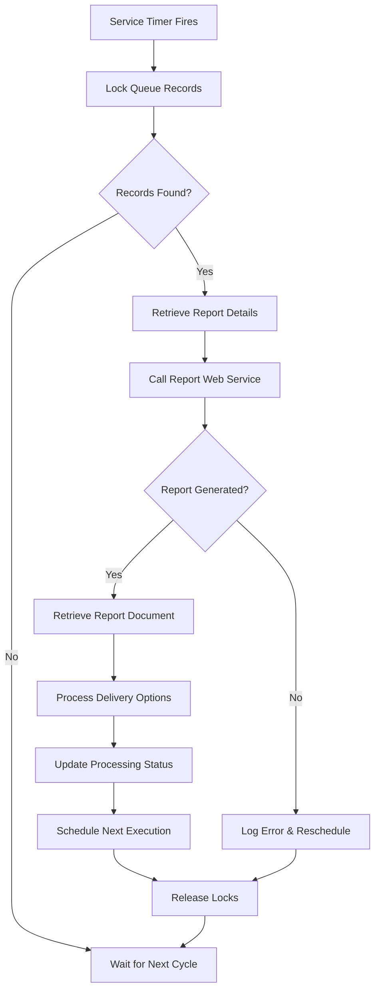

# Reporter Service

A Windows service that continuously monitors a queue of report generation requests, processes them using integrated Crystal Reports, and delivers the generated reports to designated destinations.

## Overview

The Reporter Service is a robust, enterprise-grade Windows service designed to handle automated report generation and distribution. It operates as a background service that monitors a SQL Server database queue for report generation requests, processes them using Crystal Reports, and delivers the completed reports via various channels including email, file systems, FTP, and direct printing.

## Architecture

### Core Components

1. **Windows Service Framework**: Built on .NET Framework 4.0 using VB.NET
2. **Database Integration**: SQL Server connectivity for queue management and configuration
3. **Report Engine**: Crystal Reports integration for report generation
4. **Web Service Integration**: HTTP-based communication with reporting services
5. **Logging System**: Comprehensive logging using log4net framework
6. **Registry Configuration**: Windows Registry-based configuration management

### Service Architecture

```
┌─────────────────┐    ┌─────────────────┐    ┌─────────────────┐
│   Windows       │    │   SQL Server    │    │   Report        │
│   Service       │◄──►│   Database      │◄──►│   Engine        │
│   (Timer)       │    │   (Queue)       │    │   (Crystal)     │
└─────────────────┘    └─────────────────┘    └─────────────────┘
         │                       │                       │
         ▼                       ▼                       ▼
┌─────────────────┐    ┌─────────────────┐    ┌─────────────────┐
│   Logging       │    │   Web Services  │    │   Delivery      │
│   (log4net)     │    │   (HTTP)        │    │   (Email/FTP)   │
└─────────────────┘    └─────────────────┘    └─────────────────┘
```

## Key Features

### 1. Queue-Based Processing
- Monitors `REPORT_EXECUTION_SCHEDULE` table for pending report requests
- Implements row-level locking to prevent duplicate processing
- Configurable batch processing (default: 2 records per cycle)
- Automatic retry logic for failed reports

### 2. Flexible Scheduling
- Supports multiple frequency types:
  - Daily
  - Weekly
  - Monthly
  - Quarterly
  - Yearly
  - One-time execution
- Configurable execution intervals
- Automatic rescheduling based on frequency settings

### 3. Multiple Output Formats
- PDF documents
- Excel spreadsheets (.XLS)
- Word documents (.DOC)
- CSV files
- XML documents

### 4. Delivery Options
- **Email**: Direct email delivery to recipients
- **File System**: Save to specified network or local paths
- **FTP**: Upload to remote FTP servers
- **Portal**: Integration with web portals
- **Direct Printing**: Send reports directly to network printers

### 5. Comprehensive Logging
- Event log integration
- File-based logging with rotation
- Remote syslog support
- Debug and error tracking
- Performance monitoring

### 6. Error Handling
- Automatic retry mechanisms
- Error notification system
- Detailed error logging
- Graceful failure handling

## Database Schema

The service relies on a comprehensive SQL Server database schema that includes:

### Core Tables
- **REPORTS**: Report definitions and metadata
- **REPORT_ENTITIES**: Report-organization relationships
- **REPORT_EXECUTION_SCHEDULE**: Queue management and scheduling
- **REPORT_DESTINATIONS**: Delivery configuration
- **PROCESSING_QUEUE**: Processing status tracking

### Supporting Tables
- **CONTACTS**: User and contact information
- **ORGANIZATIONS**: Organizational structure
- **SESSIONS**: Training session management
- **LIST_OF_VALUES**: Configuration lookups
- **DOCUMENT_MANAGEMENT**: Document storage metadata

## Configuration

### Registry Settings
The service stores configuration in the Windows Registry under `HKEY_LOCAL_MACHINE\Software\ReporterService`:

| Setting | Description | Default |
|---------|-------------|---------|
| MyInterval | Timer interval in seconds | 5 |
| UserName | Database username | sa |
| Password | Database password | YourPasswordHere |
| DBName | Database name | YourDatabaseName |
| DBServer | Database server | YourServerName\YourInstanceName |
| Debug | Enable debug logging | Y |
| Logging | Enable general logging | Y |

### Application Configuration
The `app.config` file contains:
- Web service endpoints
- Logging configuration
- Network settings

## Service Lifecycle

### Startup Process
1. Initialize logging system
2. Read configuration from registry
3. Create default registry entries if missing
4. Establish database connections
5. Start timer-based processing
6. Log service startup

### Processing Cycle
1. **Queue Locking**: Lock pending records to prevent duplicate processing
2. **Record Retrieval**: Fetch locked records for processing
3. **Report Generation**: Call web service to generate reports
4. **Document Retrieval**: Download generated report documents
5. **Delivery Processing**: Send reports to specified destinations
6. **Status Updates**: Update processing status and schedule next execution
7. **Cleanup**: Release locks and log results

### Shutdown Process
1. Stop timer processing
2. Complete current operations
3. Close database connections
4. Flush log buffers
5. Log service shutdown

## Report Processing Flow



## Security Considerations

### Database Security
- Uses SQL Server authentication
- Implements connection pooling
- Row-level locking prevents data corruption
- Audit trails for all operations

### Network Security
- Configurable proxy settings
- SSL/TLS support for web services
- Secure credential storage in registry

### File System Security
- Temporary file cleanup
- Secure document storage
- Access control for output directories

## Performance Characteristics

### Scalability
- Configurable batch processing
- Efficient database queries with proper indexing
- Connection pooling for database operations
- Asynchronous processing capabilities

### Reliability
- Automatic retry mechanisms
- Comprehensive error handling
- Transaction-based operations
- Graceful degradation

### Monitoring
- Real-time status tracking
- Performance metrics logging
- Health check capabilities
- Alert notification system

## Dependencies

### Required Software
- Windows Server 2008 R2 or later
- .NET Framework 4.0 or later
- SQL Server 2008 or later
- Crystal Reports Runtime
- Spire.PDF library (for PDF processing)

### Network Requirements
- Database server connectivity
- Web service endpoint access
- SMTP server access (for email delivery)
- FTP server access (for file delivery)
- Network printer access (for direct printing)

## Logging and Monitoring

### Log Levels
- **DEBUG**: Detailed processing information
- **INFO**: General service operations
- **WARN**: Non-critical issues
- **ERROR**: Processing failures
- **FATAL**: Critical system errors

### Log Destinations
- Windows Event Log
- File-based logs with rotation
- Remote syslog servers
- Console output (for debugging)

### Monitoring Capabilities
- Service status monitoring
- Queue depth tracking
- Processing performance metrics
- Error rate monitoring
- Resource utilization tracking

## Troubleshooting

### Common Issues

1. **Service Won't Start**
   - Check registry permissions
   - Verify database connectivity
   - Review event logs for errors

2. **Reports Not Processing**
   - Verify queue has pending records
   - Check web service connectivity
   - Review database locks

3. **Delivery Failures**
   - Verify destination configurations
   - Check network connectivity
   - Review authentication credentials

4. **Performance Issues**
   - Adjust batch processing size
   - Optimize database queries
   - Review system resources

### Diagnostic Tools
- Windows Event Viewer
- Service Control Manager
- Database query tools
- Network monitoring tools

## Development and Maintenance

### Code Structure
- Modular design with clear separation of concerns
- Comprehensive error handling
- Extensive logging and debugging support
- Configuration-driven behavior

### Testing
- Unit testing capabilities
- Integration testing support
- Performance testing tools
- Load testing scenarios

### Deployment
- Windows service installation
- Configuration management
- Database schema deployment
- Monitoring setup

## Future Enhancements

### Planned Features
- REST API integration
- Cloud-based delivery options
- Advanced scheduling capabilities
- Real-time monitoring dashboard
- Multi-tenant support

### Scalability Improvements
- Distributed processing
- Load balancing
- Clustering support
- Microservices architecture

## Support and Documentation

### Additional Resources
- Installation guide
- Configuration reference
- API documentation
- Troubleshooting guide

### Contact Information
For technical support and questions, please refer to the CUSTOMIZING.md file for implementation-specific guidance.

---

*This service provides a robust foundation for enterprise report generation and distribution, with extensive configurability and monitoring capabilities to meet diverse organizational needs.*
